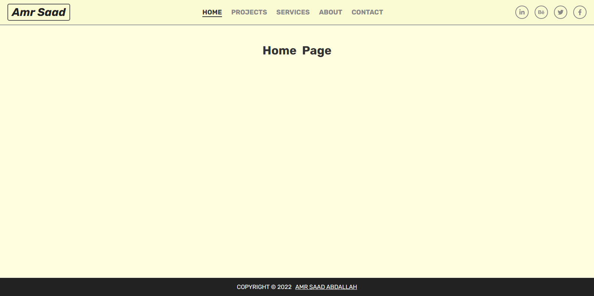
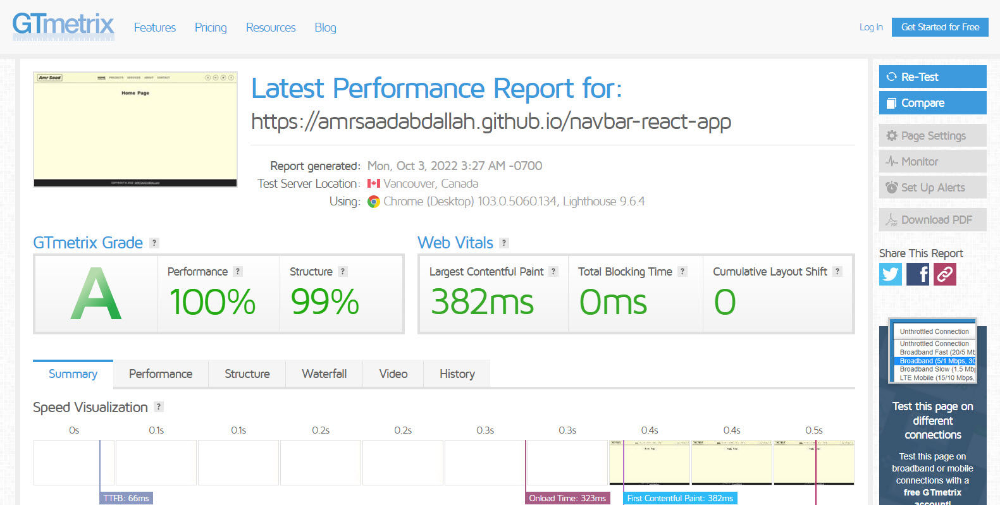

<h1 align="center" > Navbar Component &mdash; React App  </h1>

### 👁️ Project Preview:

- [ Live Preview 👉 https://amrsaadabdallah.github.io/navbar-react-app](https://amrsaadabdallah.github.io/navbar-react-app)

- [ Github Repo 👉 https://github.com/amrsaadabdallah/my-navbar-react-app](https://github.com/amrsaadabdallah/my-navbar-react-app)
    - 🚩 It's a private repo <a target="_blank" href="mailto:amrsaadabdallah@gmail.com">contact me </a>to see.

---

### 📝 Project Description & features:

- It's a tiny react app (navbar) used to practice basic react features.
- It's applied client side routing by using react-router-dom V6.
- It's responsive navbar in mobile devices has a toggler button.
- It's close navlist in mobile devices when click on any nav list.

---

### 🛠️ Project Tools:

1. Used Google Fonts.

1. ReactJS Library.

1. Style using sass.

1. PropTypes package for typechecking component props.

1. react-icons packages.

1. react-router-dom package to handle client side routing.

1. [GTmetrix](https://gtmetrix.com/) is an online tool for customers to easily test the performance of their webpages.

---

### :sparkles: Project Skills applied:

1. Create Multiple React Component.

1. Configuration react component by props.

1. Render List of items.

1. Apply Conditional Rendering.

1. Multiple pages in SPA using react-router-dom package.

1. Use React Hook (UseState, useEffect, useRef).

1. Typechecking component props With PropTypes package.

1. Test the performance of the webpage after deploy by using [GTmetrix](https://gtmetrix.com/).

---

### 🧪 Project performance test:

Test the performance of the webpage after deploy by using [GTmetrix](https://gtmetrix.com/).

---

### 👋 Get In Touch:

- [🌐 Website 👉 https://amrsaadabdallah.github.io](https://amrsaadabdallah.github.io)
- [👔 LinkedIn 👉 https://www.linkedin.com/in/amrsaadabdallah](https://www.linkedin.com/in/amrsaadabdallah)
- [🌟 Github 👉 https://github.com/amrsaadabdallah](https://github.com/amrsaadabdallah)
- [📧 Gmail 👉 amrsaadabdallah@gmail.com](mailto:amrsaadabdallah@gmail.com)
- [🐤 Twitter 👉 https://twitter.com/amrsaadabdallah](https://twitter.com/amrsaadabdallah)
- [:phone: Whatsapp 👉 (+20) 109-775-6067](https://api.whatsapp.com/send/?phone=%2B2001097756067&text&type=phone_number&app_absent=0)

---

<a target="_blank" href="https://amrsaadabdallah.github.io">

 2022 &copy; Amr Saad Abdallah 

</a>

